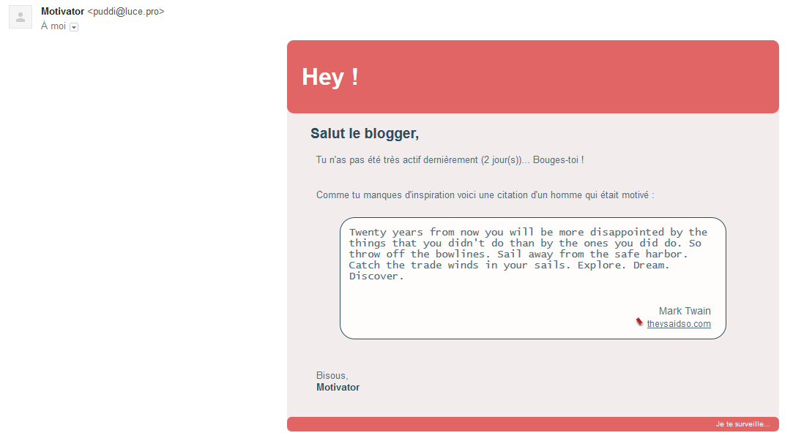

## Motivator

Petit outil (inutile?) écrit en nodejs qui envoie un rappel lorsqu'aucun post n'a été publié depuis N jours sur le blog.

Fonctionne avec un blog [Hexo](https://hexo.io/).

### How to

Pour l'utiliser, `npm install`, puis changer le fichier `config.ini`.

### Resultat

### Auteur
Auteur : Thomas Luce

Licence : Apache V2