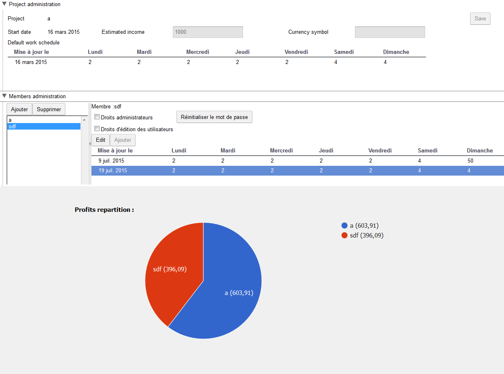

## Sharelootor (en cours)

Un site permettant de partager équitablement les profits d'un projet suivant le temps de travail de chacun.

Chaque collaborateur indique sa semaine type de travail et s'engage de bonne foi à la respecter. Le site donne alors à une date donnée le partage à faire.

Le client est fait avec GWT, et le serveur avec NodeJS.

### How to

Compiler le client, puis le placer dans le dossier public du serveur.

Se placer dans le dossier `server` et lancer la commande `passenger start`.

### Resultat

### Auteur
Auteur : Thomas Luce

Licence : Apache V2
